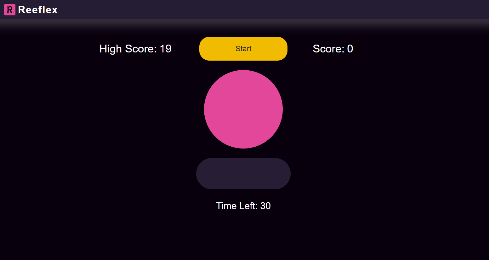

# Reflex Game

A fast-paced browser-based reflex and typing game built with vanilla JavaScript. Players must quickly press the character displayed on screen before it changes. As the score increases, the game becomes faster and introduces numbers and special characters, testing both reaction speed and keyboard accuracy.

## Preview

## Features
- 30-second timed challenge
- Countdown before game start
- Progressive difficulty scaling
- Letters, numbers, and special characters
- High score saved using Local Storage
- Accuracy tracking
- Visual feedback for incorrect inputs

## How to Play
1. Click Start.
2. Wait for the countdown.
3. Press the key shown on the screen.
4. Score points for correct inputs.
5. Try to achieve the highest score before time runs out.

## Technologies Used
- HTML
- CSS
- JavaScript (Vanilla)

## Author

**Abdullah Ghazi**  
GitHub: https://github.com/Abdullah-Ghazi0  
LinkedIn: https://www.linkedin.com/in/abdullah-ghazi-swe/